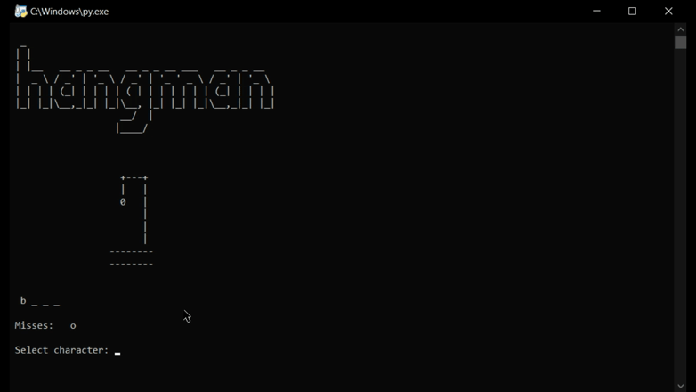

# Hangman 

## Table of contents
* [Get Started](#get-started)
* [Introduction](#introduction)
* [Demo](#demo)
* [Setup](#setup)
* [Built with](#built-with)
* [How to use](#how-to-use)
* [To-do](#to-do)
* [Download](#download)

# Get Started

## Introduction
Hangman is the game where the word to guess is represented by a row of dashes, representing each letter of the word.The player guessing the word may, at any time, attempt to guess the whole word. As the name of the game suggests, the diagram is designed to look like a hanging man.  As the player continues, a part of the stick figure on the noose is added. Once a full body is drawn, the game is over, and the player lost. [read more...](https://en.wikipedia.org/wiki/Hangman_(game))

## Demo


## Setup
To clone and run this application, you'll need [Git](https://git-scm.com/downloads), [Python](https://www.python.org/downloads/) and pip (already installed with Python 2 >=2.7.9 or Python 3 >=3.4) or [Anacond](https://docs.anaconda.com/anaconda/install/) installed on your computer.

### Built with
* Python version: 3.8.3
* pip version: 20.3.3

### Install
You can install random using pip
```consol
pip install random
```
On Anaconda install random using Anaconda Promt
```consol
conda install random
```

## How to use?
From your command line:
```console
# Clone this repository
$ git clone https://github.com/tirth1/hangman

# Go into the repository
$ cd hangman

# run main.py
$ python main.py

```

## To-do
* Add api to get different words.
* At the end of game show meaning of that word.

## Download
You can [download](https://github.com/tirth1/hangman/releases/tag/1.0.1) the latest installable version of Hangman for Windows, Linux and macOS.
